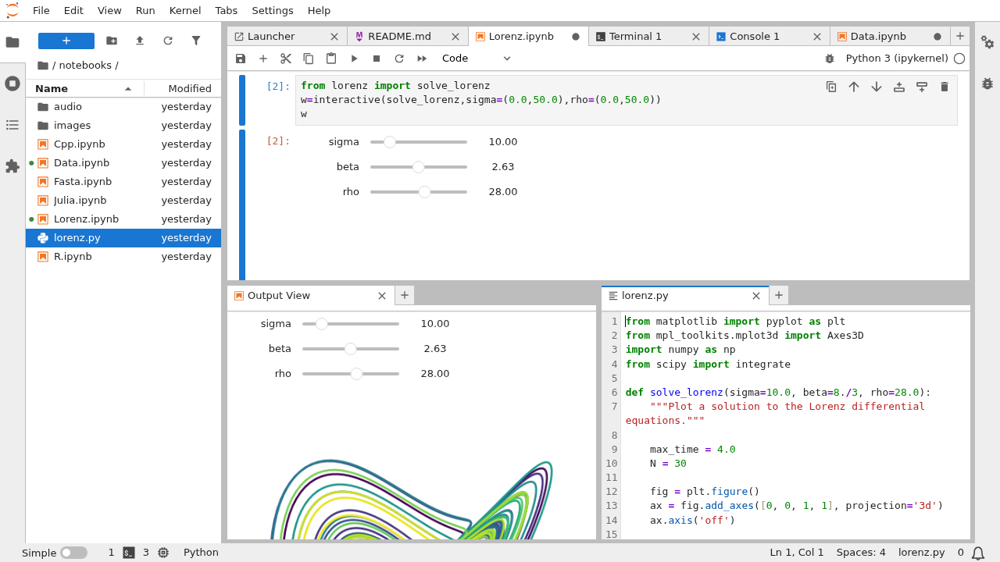
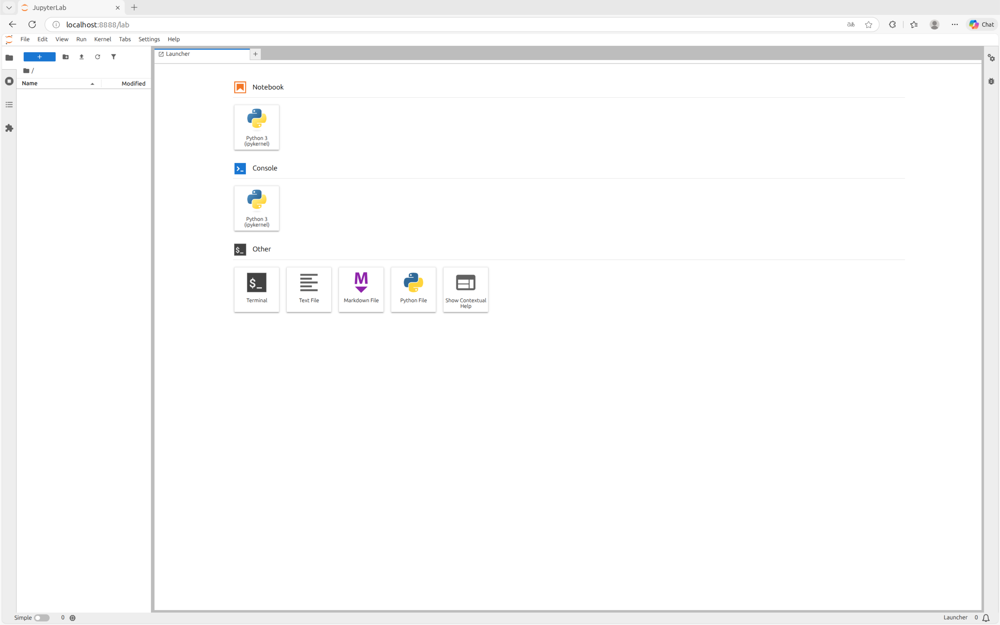

## ¿Qué es un notebook?

- Es un documento que mezcla texto plano, código, datos, y visualizaciones (gráficas, diagramas, gráficos 3D, ...)
- Proviene de la definición de Donald Knuth de **literate programming**
- Permite mezclar explicaciones técnicas y elementos gráficos a través de la ejecición de los códigos asociados
- Es muy utilizado en muchos ámbitos, entre otros en ciencia de datos
- Permite compartir notebooks y que cualquiera pueda reproducir los mismos pasos que el que lo definió

## Kernels

- Para que un notebook pueda ejecutar código necesita un kernel
- Un kernel es un intérprete que puede ejecutar código en algún lenguaje específico
- Existen kernels para muchos lenguajes (inluyendo Java), aunque los originales son los de Python, Julia y R, tres lenguajes muy usados en ciencia de datos

## El proyecto Jupyter

- Free software, open standards, and web services for interactive computing across all programming languages
- El proyecto Jupyter se focaliza en crear software para lo que denominan computación interactiva
- Relacionado con los notebooks tiene dos proyectos:
    - JupyterLab: la nueva implementación de notebooks que permite trabajar con varios notebooks en un workspace
    - Jupyter Notebook: una implementación más antigua pero que se sigue manteniendo que trabaja con un sólo notebook.
- Nos centraremos en JupyterLabs

## JupyterLab



## Instalación

- Crea un entorno para instalarlo en alguna carpeta
- Activa el entorno
- Instalación con `pip`:

```shell
pip install jupyterlab
```

## Notebooks

- Jupyter Lab viene con una aplicación web que nos permite trabajar con notebooks
- Ejecutando el siguiente comando el servidor web se iniciará y se nos abrirá un navegador con la UI de Jupyter Lab

```shell
jupyter lab
```



## Notebooks

- Un notebook se compone de celdas
- Una celda puede ser de varios tipos: texto en markdown, código, o raw
- Las celdas de tipo código pueden ejecutarse
    - El resultado sale debajo como otra celda
    - Los errores se reportan también dentro de la celda que muestra el resultado
- Podemos crear un nuevo notebook y se guardará en la carpeta desde donde hayamos lanzado Jupyter Lab

## Notebooks {.smaller}

- Podemos importar paquetes que tengamos instalados en el entorno en el que estamos corriendo Jupyter Lab
- Ejemplo:
    - Instala `matplotlib` en el entorno virtual
    - Introduce el siguiente código en una celda de tipo código

```python
import matplotlib.pyplot as plt

x = [1, 2, 3, 4, 5]
y = [1, 4, 9, 16, 25]

plt.plot(x, y)
plt.show()
```

## Notebooks

- Una vez importado un paquete podemos usarlo en celdas posteriores sin tener que volver a importarlo
- Lo mismo sucede con las variables que definamos


## Uso en vscode {.smaller}

:::{.columns}

::::{.column width=40%}
- Se pueden utilizar Jupyter en **vscode**
- Basta con tener el entorno .venv jupyter instalado
- Abrimos la carpeta donde está el entorno con vscode
- vscode detecta automáticamente los ficheros con extensión `ipynb` y nos los muestra en una vista de tipo notebook
::::

::::{.column wdth=60%}

::::

:::

